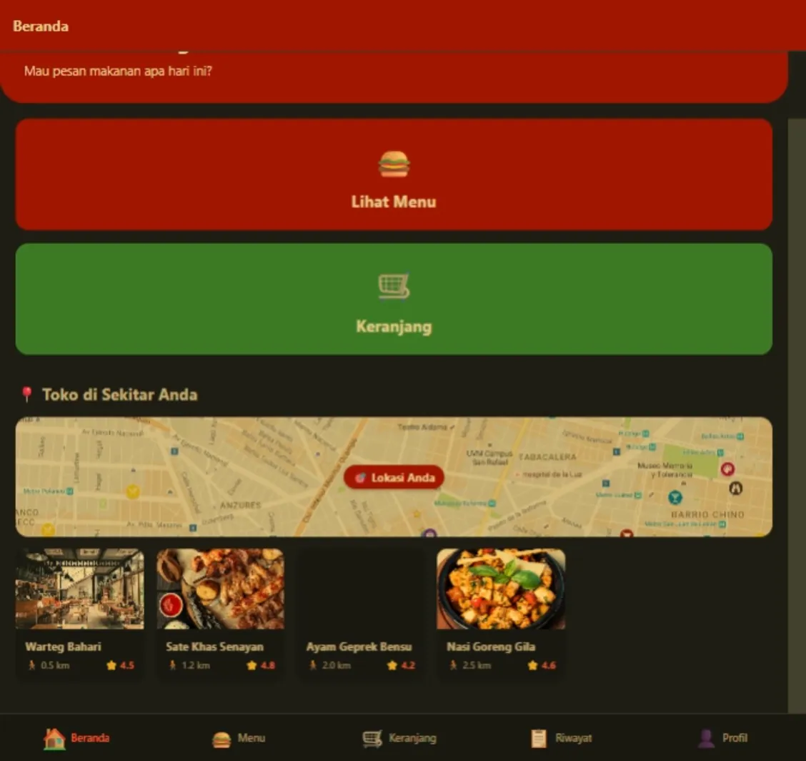
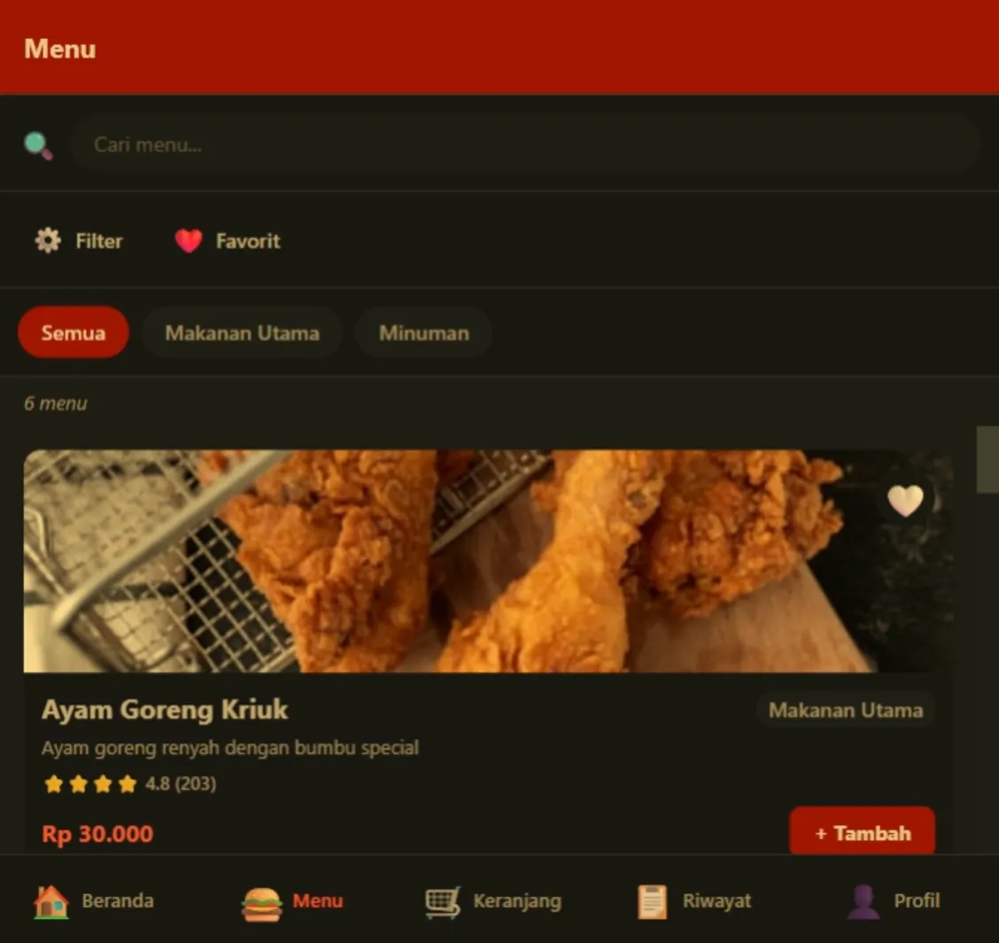
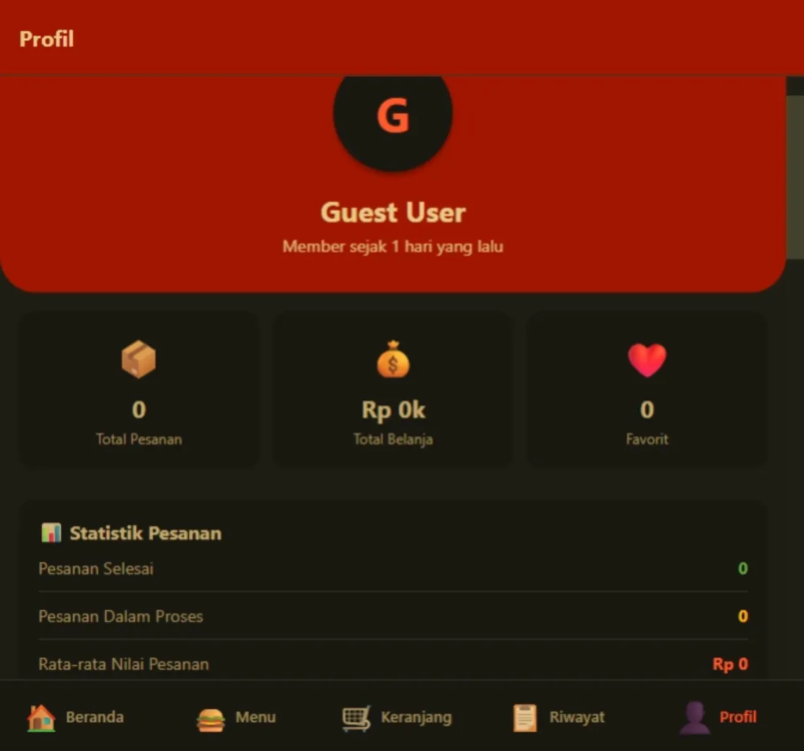
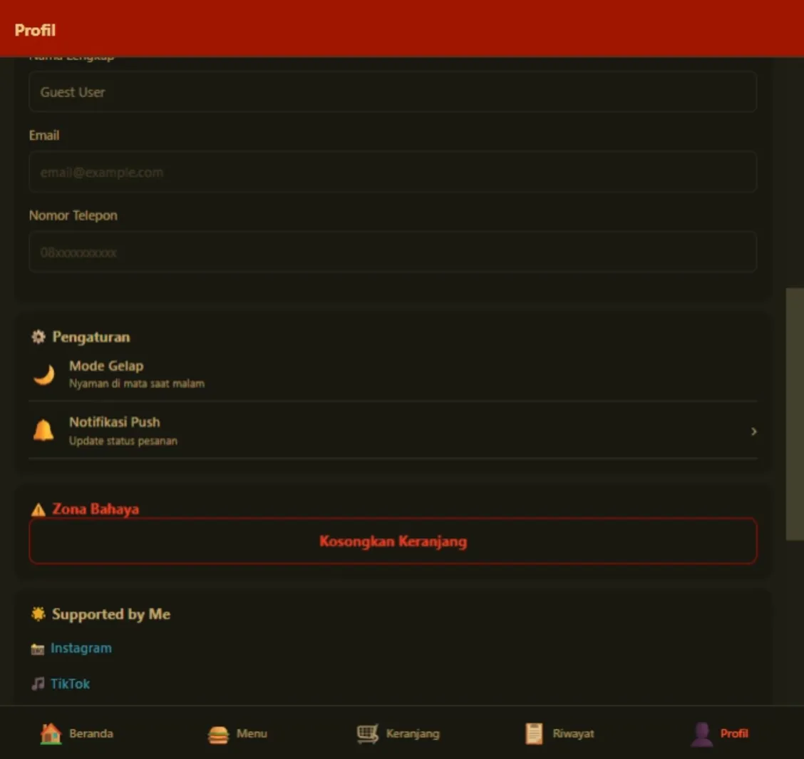
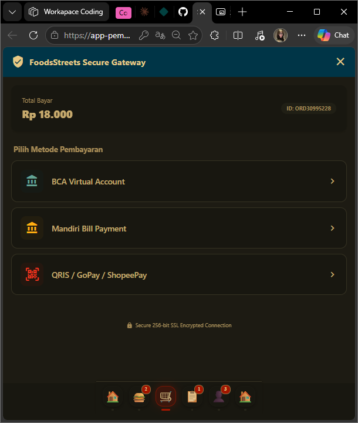
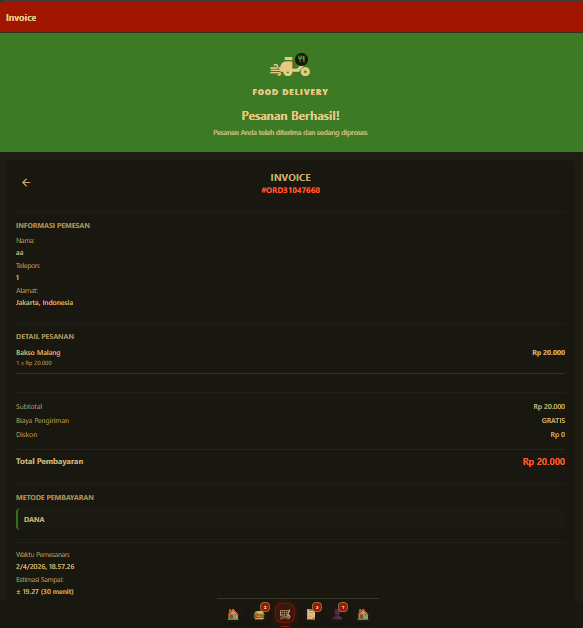

<div align="center">

# 🍽️ Aplikasi Pemesanan Makanan

**Aplikasi mobile pemesanan makanan yang praktis dan mudah digunakan**

[](https://reactnative.dev/)
[](https://expo.dev/)
[](https://developer.mozilla.org/en-US/docs/Web/JavaScript)
[](https://opensource.org/licenses/MIT)

[](https://expo.dev/)
[]()
[](http://makeapullrequest.com)

</div>

---

## 📖 Tentang Aplikasi

Aplikasi pemesanan makanan berbasis **React Native + Expo** yang memungkinkan pelanggan menelusuri menu, menambahkan item ke keranjang, melakukan pembayaran, dan melacak riwayat pesanan — langsung dari smartphone dengan antarmuka yang simpel dan intuitif.

---

## 📸 Screenshots

<div align="center">

### 🏠 Beranda & 🍽️ Menu
| Beranda | Menu |
|--------|------|
|  |  |

### 👤 Profil & ⚙️ Pengaturan
| Profil | Pengaturan |
|--------|------------|
|  |  |

### 💳 Pembayaran & 🧾 Invoice
| Pembayaran | Invoice |
|--------|------------|
|  |  |

### 👨🏼‍💻Admin & 🧾 Riwayat Pesanan
| Admin | Riwayat Pesanan |
|--------|------------|
|  |  |

</div>

---

## ✨ Fitur

| Fitur | Deskripsi | Status |
|-------|-----------|--------|
| 🎬 **Splash Screen** | Layar pembuka saat aplikasi pertama dijalankan | ✅ Tersedia |
| 🚀 **Onboarding** | Panduan singkat untuk pengguna baru dengan animasi | ✅ Tersedia |
| 🏠 **Beranda** | Quick action, peta toko terdekat, dan rekomendasi menu | ✅ Tersedia |
| 🗺️ **Toko Terdekat** | Menampilkan toko di sekitar lokasi pengguna via Maps | ✅ Tersedia |
| 🍽️ **Menu** | Daftar makanan dengan pencarian, filter, dan kategori | ✅ Tersedia |
| ❤️ **Favorit** | Tandai dan simpan menu favorit | ✅ Tersedia |
| ⭐ **Rating Menu** | Menampilkan rating dan jumlah ulasan per menu | ✅ Tersedia |
| 🛒 **Keranjang** | Kelola item pesanan sebelum checkout | ✅ Tersedia |
| 💳 **Pembayaran** | Proses pembayaran pesanan | ✅ Tersedia |
| 🧾 **Invoice** | Struk/bukti transaksi setelah pesanan berhasil | ✅ Tersedia |
| 📋 **Riwayat Pesanan** | Melihat daftar pesanan yang pernah dilakukan | ✅ Tersedia |
| 👤 **Profil & Statistik** | Data profil, total pesanan, belanja, dan favorit | ✅ Tersedia |
| 🌙 **Mode Gelap** | Tampilan dark mode untuk kenyamanan malam hari | ✅ Tersedia |
| 🔔 **Notifikasi Push** | Update status pesanan secara real-time | ✅ Tersedia |
| 🗂️ **Panel Admin** | Manajemen menu dan pesanan | 🚧 Coming Soon |

---

## 🛠️ Teknologi yang Digunakan

- **[React Native](https://reactnative.dev/)** — Framework utama pengembangan aplikasi mobile
- **[Expo](https://expo.dev/)** — Toolchain & framework untuk mempercepat development
- **JavaScript** — Bahasa pemrograman utama
- **Lottie** — Animasi berbasis JSON
- **Context API** — State management global aplikasi
- **Maps Integration** — Menampilkan peta dan toko terdekat

---

## 🚀 Cara Menjalankan Proyek

### Prasyarat

Pastikan sudah terinstal:
- [Node.js](https://nodejs.org/) versi 16 ke atas
- [Expo CLI](https://docs.expo.dev/get-started/installation/)
- Aplikasi **Expo Go** di smartphone (Android/iOS)

### Instalasi

```bash
# 1. Clone repository ini
git clone https://github.com/siswayangtidakmencolok-afk/App_food_order-ReactNative.git

# 2. Masuk ke direktori proyek
cd App_food_order-ReactNative

# 3. Install dependencies
npm install

# 4. Jalankan aplikasi
npx expo start
```

### Menjalankan di Device

Setelah `npx expo start` berjalan:
- **Android/iOS** → Scan QR code menggunakan aplikasi **Expo Go**
- **Android Emulator** → Tekan `a` di terminal
- **iOS Simulator** → Tekan `i` di terminal

---

## 📁 Struktur Proyek

```
AplikasiPemesananMakanan/
├── assets/
│   ├── lottie/
│   │   └── success.json
│   └── screenshots/          ← Simpan screenshot app di sini
│       ├── home.jpg
│       ├── menu.jpg
│       ├── profile.jpg
│       └── settings.jpg
├── pullrequest
│   └── .gitattributes
├── scripts/
│   └── reset-project.js
├── src/
│   ├── assets/
│   │   ├── lottie/
│   │   │   └── success.json
│   │   └── screenshots/          
│   │       ├── home.jpg
│   │       ├── menu.jpg
│   │       ├── profile.jpg
│   │       └── settings.jpg
│   ├── components/
│   │   ├── Aurora.native.js
│   │   ├── AnimatedLogo.js
│   │   ├── Aurora.web.js
│   │   ├── AnimatedLogo.web.js
│   │   ├── AnimatedDock.native.js
│   │   ├── AnimatedDock.web.js
│   │   ├── CartItem.js
│   │   ├── FoodCard.js
│   │   ├── GlobalToast.js
│   │   ├── MapComponent.js
│   │   ├── MenuReview.js
│   │   ├── OnboardingAnimation.js
│   │   ├── OnboardingAnimation.native.js
│   │   ├── PinInput.js
│   │   └── SuccessAnimation.js
│   ├── config/
│   │   ├── maps.js
│   │   ├── supabase.js
│   │   └── theme.js
│   ├── context/
│   │   └── AppContext.js
│   ├── data/
│   │   └── menuData.js
│   └── screens/
│       ├── AuthScreen.js
│       ├── SplashScreen.js
│       ├── OnboardingScreen.js
│       ├── GateawayScreen.js
│       ├── HomeScreen.js
│       ├── MenuScreen.js
│       ├── MenuDetailScreen.js
│       ├── CartScreen.js
│       ├── DeliveryScreen.js
│       ├── PaymentScreen.js
│       ├── InvoiceScreen.js
│       ├── OrderHistoryScreen.js
│       └── ProfileScreen.js
├── services/
│   └── menuService.js
│   └── eWallet.js
│   └── mitransService.js
├── App.js
├── .gitignore
├── LICENSE
├── package.json
└── package-lock.json
```

---

## 🗺️ Roadmap

- [x] Splash Screen & Onboarding
- [x] Beranda dengan Maps & Toko Terdekat
- [x] Menu dengan Pencarian, Filter & Favorit
- [x] Detail Menu & Rating
- [x] Keranjang Belanja
- [x] Proses Pembayaran
- [x] Invoice / Struk Pesanan
- [x] Riwayat Pesanan
- [x] Profil & Statistik Pesanan
- [x] Mode Gelap
- [x] Notifikasi Push
- [ ] Panel Admin
- [ ] Integrasi Backend & Database
- [ ] Autentikasi Login / Register

---

## 🤝 Kontribusi

Kontribusi sangat terbuka! Berikut caranya:

1. Fork repository ini
2. Buat branch fitur baru (`git checkout -b fitur/nama-fitur`)
3. Commit perubahan (`git commit -m 'Tambah fitur X'`)
4. Push ke branch (`git push origin fitur/nama-fitur`)
5. Buat Pull Request

---

## 📄 Lisensi

Proyek ini menggunakan lisensi **MIT** — lihat file [LICENSE](LICENSE) untuk detail lengkap.

---

<div align="center">

Dibuat oleh fhazwan menggunakan React Native & Expo

</div>
